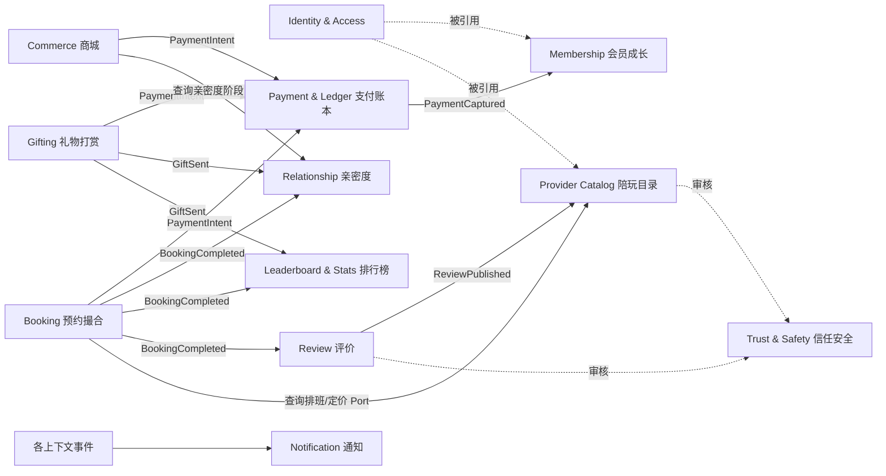

# 领域模型

来源：`../../ui/index.html` 静态原型（首页：陪玩推荐 / 排行榜 / 老板等级体系 / 亲密度与礼物墙 / 商城预览；商城页：分类筛选 / 商品卡 / 详情弹窗 / 心愿单）。

## 1. 原型功能盘点与遗漏领域分析

最初的范围设想是「用户 / 订单 / 货架 / 支付」四个基本域。对照原型逐项核实后，识别出以下额外领域：

| 领域 | 原型证据 | 为什么不能塞进原有四个域 |
|---|---|---|
| 陪玩服务目录（Provider Catalog） | 陪玩卡片：昵称/头像/游戏标签/¥每小时/评分/推荐语 | 服务提供者档案，不是商品；按时长计价、排期属性与货架商品完全不同 |
| 预约撮合（Booking） | "预约"按钮，按小时计价 | 本质是"服务订单"，但状态机（同一时段防重）和库存扣减模式与商品订单不同，不能共用一个聚合 |
| 礼物打赏（Gifting） | 礼物墙：鲜花/蜡烛/信笺/耳环/皇冠/星辰吊坠，各自有解锁条件 | 第三种"下单"行为（虚拟商品购买+赠送），但会连带触发亲密度、会员成长、排行榜三个下游 |
| 亲密度/关系（Relationship） | 老板×陪玩配对的进度条，5 个阶段 | "一对关系"的状态，不属于用户实体本身，也不属于任何订单 |
| 会员成长体系（Membership） | Lv1-5，累计消费触发，每级有专属权益 | 权益要被 Booking（优先排队）等其他域反向查询，是独立的权益实体 |
| 排行榜/统计（Leaderboard） | 陪玩榜(魅力值)、老板榜(守护值)，每周一更新 | 聚合读模型，不该现查现算联表，应为事件驱动的独立投影（CQRS） |
| 评价评分（Review） | 陪玩卡片上的 ★4.9 | 评分必然来自已完成服务订单后的评价，需要独立域产出 |
| 心愿单（Wishlist） | 商品详情弹窗"加入心愿单" | 原型里**没有真正的购物车/结算流程**，只有心愿单占位，真正下单链路需补全 |
| 准入资格/限购规则 | "传奇搭档"限定钥匙扣，仅亲密度顶级老板可购买 | 跨域规则（商城 × 关系域），须经防腐层查询，不能让 Commerce 直接依赖 Relationship 内部数据 |
| 库存 | 商城页隐含 | 货架商品履约需要库存扣减/预占 |
| 信任与安全 | 未在原型出现，但陪玩入驻审核、评价审核、举报是运营刚需 | 沿用早期预研报告中的 `trust-safety` 域 |
| 通知 | 排行榜更新、等级升级、收礼、预约确认都需要触达 | 独立的事件消费方，失败不能回滚业务订单 |

## 2. 限界上下文（Bounded Context）

Booking（服务订单）与 Commerce（商品订单）**不合并为通用 Order 聚合**——时段占用与库存扣减的不变量完全不同，硬合会互相牵制。"我的订单"列表页通过跨域查询（CQRS 读模型）拼接两边数据。

## 3. 聚合 / 实体 / 值对象设计

### Identity & Access（身份与访问，S1+S2 老板侧已实现，见 mystikos-identity）
- `User`(id, phone?, email?, passwordHash?, nickname?, privacyAnonymous, gender: MALE\|FEMALE\|UNDISCLOSED, avatarUrl?, birthDate?, bio?, regionCode?, tagIds: Set&lt;Long&gt;, status: ACTIVE\|DISABLED\|BANNED, roles: Set&lt;Role&gt;, oauthBindings: Set&lt;OAuthBinding&gt;, membershipTierLevel: Integer?, membershipTierCode: String?, createdAt)。**没有 username 字段**——手机号/邮箱二选一即可注册，不强制都填，也不需要额外的用户名；唯一性约束在 phone/email 各自的非空值上。`birthDate` 只是资料展示字段，故意不与"实名认证/未成年人标记"这个未来才会补的、独立且权威的判定字段互相赋值，避免自报生日被误当年龄证明，见第 70 行。
- `OAuthBinding`(provider: String, providerUserId, boundAt)：provider 是字符串不是枚举，接入新的第三方登录供应商（Discord/微信……）不用改这个值对象。一个用户可以绑多个 provider。
- `Role` 枚举（固定 6 个，不做运行时可增删的动态角色）：GUEST 游客、MEMBER 会员用户、COMPANION 陪玩、CUSTOMER_SERVICE 客服、ASSESSOR 考核官、ADMIN 管理员。一个用户可以同时拥有多个角色（比如既是会员又是陪玩）。**Java 枚举仍是行为/展示名的权威来源**，`identity_role` 表（code/displayName/sortOrder）是枚举的数据库镜像，只用来给 `identity_user_role`/`identity_role_permission` 提供外键完整性——新增角色要同时改枚举和加一行种子数据，两边手动保持同步，不是运行时可通过接口新增角色。`GET /api/v1/roles` 直接读枚举返回，不查表。
- 权限（RBAC 的 P）：`identity_role_permission`(role, permission_code) 关联表驱动，不是独立聚合——权限编码由业务后续定义，框架里不预置任何编码。`ADMIN` 角色隐含拥有全部权限（`resolvePermissions` 返回通配符 `"*"`），不查表。
- 会员等级：只存 `membershipTierLevel`/`membershipTierCode` 两个字段，具体梯度（有几级、门槛多少）由 [`MembershipTier`](../../mystikos-common/src/main/java/com/mystikos/common/membership/MembershipTier.java) 接口的某个实现给出——**这个接口目前没有任何实现，梯度故意留空**，业务定义后接一个枚举或配置表实现即可，`User.updateMembershipTier(MembershipTier)` 不用跟着改。
- 老板侧资料（S2）：`nickname`、`privacyAnonymous`（匿名上榜）、`gender`/`avatarUrl`/`birthDate`/`bio`/`regionCode`/`tagIds` 都已实现，见 `ProfileController`。陪玩侧资料（标签/时薪/擅长游戏/认证审核）属于 `mystikos-provider-catalog`，尚未建设，跟这里的 `tagIds`（游戏类型偏好，后台配置目录 `TagDefinition`，`identity_tag_definition`/`identity_user_tag`）不是一回事，字面上都叫"标签"但归属和用途都不同。
  - `regionCode` 引用 `common_region.code`（国家或一级行政区的 ISO 3166-1/3166-2 编码），DB 层没有外键约束——`common_region` 是 `mystikos-common-region` 这个独立 Maven 模块提供的只读参考数据（国家+一级行政区两层树，目前种子数据覆盖欧洲），合法性校验在 `UserApplicationService` 里调用 `RegionQueryService.exists()` 完成。这个模块不是限界上下文，定位跟 `mystikos-common-storage`（对象存储）一样：纯技术能力，任何业务模块要用地区数据都可以直接依赖它，不用各自建一份。
- **认证（S1，已实现）**：
  - `VerificationCode`(channel, identifier, purpose, code, expiresAt, consumedAt) — 一次性验证码，5 分钟有效期，消费即失效
  - `RefreshToken`(userId, tokenHash, expiresAt, revokedAt) — 持久化的不透明串（存哈希），可主动吊销，不是 JWT
  - Access Token 是自签发 JWT（`mystikos-common-security` 的 `JwtTokenService`，HS256），登录/注册/刷新成功后签发；`SecurityConfig` 用自定义 `JwtAuthenticationFilter` 校验 Bearer Token，不依赖外部 OAuth2 Authorization Server 的 issuer-uri/JWKS 那一套——因为我们自己就是签发方
  - 密码登录和验证码登录都支持，手机号/邮箱二选一渠道
  - 第三方登录（`POST /api/v1/auth/oauth/{provider}/login`）**接口契约已占位，调用会返回"暂未开放"**——具体 Provider（Discord/微信……）的授权码换用户信息逻辑还没接，见 `AuthApplicationService.loginWithOAuth`
  - 验证码发送目前用 `LoggingVerificationCodeSender`（打日志，不真实发短信/邮件）——SMS/邮件服务商还没选型，选型后新增真实实现替换，不改用例代码
- 事件：`UserRegistered`（已实现）；`UserBanned`/`UserRoleChanged` 尚未接（`ban()`/`assignRole()` 目前只落库，不发事件，用例需要时再补）。
- 鉴权范围：目前只收紧了 `/api/v1/users/*/roles/**`、`/api/v1/users/*/ban`、`/api/v1/profile/**`、`/api/v1/auth/me`、`/api/v1/auth/logout`；其他模块（Booking 等）的接口鉴权范围留给各自模块设计需求时收紧。
- **待补**（PRD 对照发现的缺口，S1/S2 范围内仍未做的）：实名认证与未成年人标记（`is_minor`）需要新增校验记录，并同步给 `mystikos-payment` 做充值/赠礼限额拦截（见 [PRD 对照](prd-alignment.md#3-真实缺口不是不必要是目前域模型漏掉的)）；refresh token 没做轮换（reuse 同一个 refresh token 换 access token，没有滑动过期或一次性轮换）。

### Membership（会员成长，挂在 patronId 上，1:1，**已实现**）
- `MembershipAccount`(patronId, currentTier, cumulativeSpend, tierUpgradedAt)
- 等级梯度实现：`mystikos-membership` 的 `DefaultMembershipTier` 枚举（LV1-LV5），是 `MembershipTier` 接口第一次有真实实现，门槛是占位数值（业务确认后直接改枚举）
- **触发源是临时顶替方案**：应该订阅 `PaymentCaptured`，但 `mystikos-payment` 还没建（S6），先订阅 `mystikos-gifting` 的 `GiftSentEvent`，代码里有 `TODO(payment-integration)` 标记
- 升级后发布 `MembershipTierUpgradedEvent`，`mystikos-identity` 订阅并同步投影到 `User.membershipTierLevel/Code`（`MembershipTierUpgradedEventListener`）

### Provider Catalog（陪玩服务目录）
- `CompanionProfile`(companionId, displayName, avatarUrl, bio, tags, languages, region, status: PENDING_REVIEW\|ACTIVE\|SUSPENDED, avgRating)
- `ServiceSku`(companionId, skuId, name, unitPrice, unit=HOUR)
- 事件：`CompanionOnboarded`、`CompanionApproved`、`ServiceSkuPriceChanged`
- 排班规则（默认可预约时段模板）归属本上下文；**实际时段占用状态归属 Booking**，因为它要与 `BookingOrder` 做原子一致性约束

### Booking（预约撮合）
- `BookingOrder`(id, patronId, companionId, skuId, timeRange: tstzrange, priceSnapshot, status, version)
- 状态机：`DRAFT → PENDING_PAYMENT → PAID → MATCHING → ACCEPTED → IN_SERVICE → COMPLETED`，旁路 `CANCELLED / EXPIRED / DISPUTED / REFUNDED`
- 事件：`BookingCreated`、`BookingPaid`、`BookingAccepted`、`BookingCompleted`、`BookingCancelled`
- **PostgreSQL 落地要点**：`EXCLUDE USING gist (companion_id WITH =, time_range WITH &&) WHERE (status IN ('HELD','PAID','ACCEPTED'))`，数据库层面保证同一陪玩同一时段不会被两个订单占用

### Commerce（商城，**已实现**）
- `Product`(id, categoryId, name, description, price, images, status: ON_SHELF\|OFF_SHELF)
  - **待补**：`recommendedBy`/`eligibilityRule`（需要陪玩确认授权才能被关联推荐，不是运营单方面打标，要加一个待确认/已确认的状态）这次讨论后决定不做，字段没建，见 [PRD 对照](prd-alignment.md#3-真实缺口不是不必要是目前域模型漏掉的)
- `CartItem`(patronId, productId, quantity)——按 (patronId, productId) 唯一，没有单独的"购物车"聚合包一层
- `WishlistItem`(patronId, productId, addedAt)
- `MerchandiseOrder`(id, patronId, items 快照, totalAmount, shippingAddress, status: `DRAFT → PENDING_PAYMENT → PAID → FULFILLING → SHIPPED → COMPLETED`，旁路 `CANCELLED / REFUNDED`)——和 `BookingOrder` 一样，创建后停在 `DRAFT`，没接支付，后续流转方法留在聚合上没接用例
- `InventoryStock`(productId, availableQty, reservedQty)——下单预占、取消释放
- 事件：`OrderPlaced`（已实现）；`ProductListed`/`OrderPaid`/`OrderShipped`/`InventoryReserved` 尚未接（对应用例还没做）

### Gifting（礼物打赏，**已实现**）
- `GiftCatalogItem`(id, code, name, icon, price, unlockRuleType, unlockRuleThreshold)
  - `unlockRule` 支持的类型：`CUMULATIVE_COUNT`（累计赠送次数）、`CUMULATIVE_SPEND`（累计消费）**已实现评估**——都是 Gifting 自己的流水表能算出来的；`CONSECUTIVE_DAYS`（连续互动天数）、`LEADERBOARD_RANK`（排行榜名次）、`INTIMACY_STAGE`（亲密度阶段）**只存配置，不做解锁判定**——真评估需要 Gifting 反向查询 Leaderboard/Relationship，会和"这两个上下文订阅 Gifting 事件"的方向形成循环模块依赖，Maven 编不过
- `GiftTransaction`(id, patronId, companionId, giftId, quantity, amount, sentAt)
- 事件：`GiftSent`（已实现，下游 Relationship/Leaderboard/Membership 都订阅它，见各自小节）

### Relationship（亲密度，**已实现**）
- `IntimacyRecord`(patronId + companionId 唯一, stage: 0-4, progressValue, lastInteractionAt)——落库时代理主键 + 唯一约束模拟复合业务键
- 阶段门槛（`IntimacyStagePolicy`）是占位值，业务确认后直接改常量
- 目前只订阅 `GiftSent` 累加进度 → 事件：`IntimacyStageChanged`（已实现）；`BookingCompleted` 那一路接不上，因为 `BookingApplicationService` 目前只实现了 `createBooking`，没有任何用例真正推进到 `COMPLETED` 并发事件
- 只对外暴露只读查询接口 `GET /api/v1/relationships/{patronId}/{companionId}`——Commerce 经 Port 查询 Relationship 做"传奇搭档限定商品"准入校验这条**本轮未接**（讨论后决定 Commerce 先不做推荐关联/准入规则，见 [PRD 对照](prd-alignment.md#3-真实缺口不是不必要是目前域模型漏掉的)）

### Payment & Ledger（支付账本，被 Booking / Commerce / Gifting 共用）
- `PaymentIntent`(id, sourceType: BOOKING\|MERCHANDISE\|GIFT, sourceId, amount, currency, status: `CREATED → AUTHORIZED → CAPTURED` \| `FAILED` \| `REFUNDED`, gatewayRef, idempotencyKey)
- `LedgerEntry`（不可变账本行，append-only：intentId, direction: DEBIT\|CREDIT, amount, occurredAt）
- 事件：`PaymentCaptured`、`PaymentRefunded`
- 通过 `sourceType` + `sourceId` 回指业务订单，不持有业务细节，避免与 Booking/Commerce 耦合
- **待补**：目前只有单笔交易记账（PaymentIntent/LedgerEntry），没有"陪玩收益钱包余额 + 提现申请"这个聚合——PRD 对照发现的缺口，需要加 `Wallet`(userId, balance) 和 `WithdrawRequest`（见 [PRD 对照](prd-alignment.md#3-真实缺口不是不必要是目前域模型漏掉的)）

### Leaderboard & Stats（排行榜，纯读侧，无写聚合，**已实现**）
- `CompanionCharmStat`(companionId, charmValue)、`PatronGuardStat`(patronId, guardValue)——累计值落库，**排名实时计算**（查询时 `ORDER BY ... LIMIT`），不是原型文案"每周一更新"的冻结快照；要做真正的周榜需要另加 `@Scheduled` 定时任务重算快照，本轮先做实时版本
- 目前只订阅 `GiftSent` 累加数值；`BookingCompleted` 那一路接不上，理由同 Relationship 小节

### Review（评价，**排期降级，见下**）
- `Review`(id, bookingOrderId, patronId, companionId, rating: 1-5, comment, status: PUBLISHED\|HIDDEN)
- 事件：`ReviewPublished` → Provider Catalog 订阅更新 `CompanionProfile.avgRating`
- 后端 PRD 草案的适用范围清单里没有评价功能，规则（谁能评、要不要审核、陪玩能不能回复）还没定。模块骨架保留，但不排进前两阶段，等 PRD 或产品侧明确规则再动字段和状态机（见 [PRD 对照](prd-alignment.md#4-建议重新评估mystikos-review)）。

### Trust & Safety（信任与安全）
- `ModerationCase`(id, targetType, targetId, reason, status, reviewerId)
- `Report`(id, reporterId, targetType, targetId, reason)
- 事件：`CaseOpened`、`CaseResolved`

### Notification（通知）
- `NotificationTask`(id, recipientId, channel: INAPP\|EMAIL\|PUSH, templateCode, payload, status: PENDING\|SENT\|FAILED)
- 消费几乎所有上下文的事件，fan-out 发送；**发送失败不能回滚业务订单**

## 4. 关键设计决策

1. **金额一律用 `NUMERIC`**，不用浮点类型。
2. **规则类字段用 JSONB**（`Product.eligibilityRule`、`GiftCatalogItem.unlockRule`），避免为每种条件建子表，用策略模式在应用层解析。
3. **跨上下文一律经查询接口（Port），不做跨表 JOIN**，尤其是 Commerce 查询 Relationship 的亲密度阶段、Booking 查询 Provider Catalog 的定价/排班。
4. **领域事件是异步下游的唯一输入**（Membership 累加消费、Relationship 累加进度、Leaderboard 累加数值、Notification 发送通知），保证这些下游故障不影响主交易链路。
5. **Booking 与 Commerce 订单分离**，"我的订单"页面在查询层聚合，不在领域层合并。

字段级设计到此可以支撑开始建表与写代码；具体到列的类型/索引/约束在各模块的 migration 脚本中细化。模块划分与跨模块通信的工程规则见 [模块结构](module-structure.md)。
